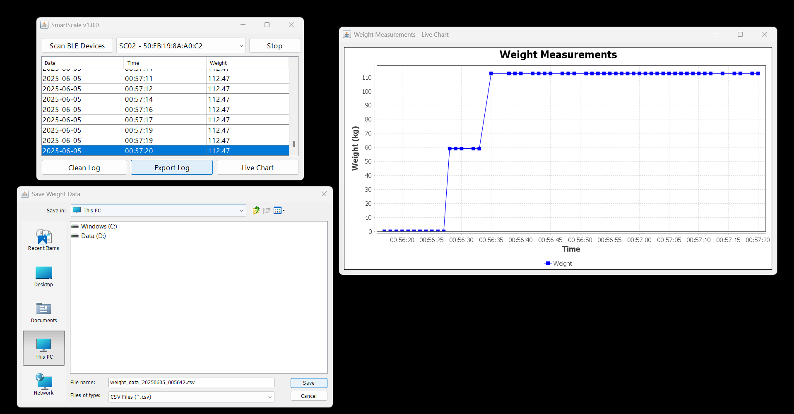

# SmartScale v1.0.0

SmartScale is a software tool designed to read, plot, and export data to Excel from live readings of a Bluetooth scale (RX402b20).  

## Demo Video

Check out a short demo of SmartScale in action:  
<p align="center">
    <a href="https://www.youtube.com/shorts/PvwOIkErZDY">
        
    </a>
</p>

# Background

Recently, I needed an affordable, compact wireless scale for some lab experiments and discovered this model:


I purchased it for $35 on Amazon ([link](https://www.amazon.com/Wireless-Bluetooth-Kitchen-Nutrient-Scale/dp/B009LCM8YY/ref=asc_df_B009LCM8YY)).


While the scale itself works well, the Android app frequently crashes after a few minutes, and the iPhone app is the only one that functions reliably. Unfortunately, there is no Windows support.

To address this, I decided to develop my own tool for use with this scale.

**The graphical user interface (GUI) is implemented in Java, while BLE communication and data retrieval are managed by Python scripts.**

## Development Process

The first step was connecting to the scale from Python. I developed the following script:

```python
import asyncio
import warnings
import json
from bleak import BleakScanner

# Suppress deprecation warnings from bleak
warnings.filterwarnings("ignore", category=FutureWarning)

TARGET_NAME = "SC02"
SCAN_TIMEOUT = 5.0

async def scan_by_name():
    try:
        devices = await asyncio.wait_for(
            BleakScanner.discover(timeout=SCAN_TIMEOUT),
            timeout=SCAN_TIMEOUT + 1
        )
        matched = [
            {
                "address": d.address,
                "name": d.name or "Unknown",
                "rssi": d.details.rssi if hasattr(d, "details") and hasattr(d.details, "rssi") else d.rssi
            }
            for d in devices
            if TARGET_NAME is None or (d.name and d.name == TARGET_NAME)
        ]
        return {
            "found": bool(matched),
            "devices": matched
        }
    except asyncio.TimeoutError:
        return {
            "found": False,
            "devices": []
        }

def main():
    return asyncio.run(scan_by_name())

if __name__ == "__main__":
    result = main()
    print(json.dumps(result, indent=2))
```

I identified the target device name with help from the nRF Connect app on Android.  
This script checks if the scale is discoverable and retrieves its MAC address, which is required for further data communication.

After connecting to the device, I used a Python script to capture the data packets it periodically transmits. Each packet contains the measured weight (in grams) and a sequence of 17 bytes representing the raw BLE payload. Here is a normalized table of sample readings:

| Weight (g) | B00 | B01 | B02 | B03 | B04 | B05 | B06 | B07 | B08 | B09 | B10 | B11 | B12 | B13 | B14 | B15 | B16 |
|------------|-----|-----|-----|-----|-----|-----|-----|-----|-----|-----|-----|-----|-----|-----|-----|-----|-----|
| 0.00       | 0f  | 05  | 02  | 00  | 00  | 00  | 5a  | 00  | 02  | 00  | 50  | fb  | 19  | 8a  | a0  | c2  | 1a  |
| 53.50      | 0f  | 05  | 02  | 00  | 14  | e6  | 5a  | 00  | 02  | 00  | 50  | fb  | 19  | 8a  | a0  | c2  | e8  |
| 53.48      | 0f  | 05  | 02  | 00  | 14  | e4  | 5a  | 00  | 02  | 00  | 50  | fb  | 19  | 8a  | a0  | c2  | ea  |
| 53.49      | 0f  | 05  | 02  | 00  | 14  | e5  | 5a  | 00  | 02  | 00  | 50  | fb  | 19  | 8a  | a0  | c2  | eb  |
| 58.92      | 0f  | 05  | 02  | 00  | 17  | 0a  | 5a  | 00  | 02  | 00  | 50  | fb  | 19  | 8a  | a0  | c2  | 07  |
| 59.04      | 0f  | 05  | 02  | 00  | 17  | 10  | 5a  | 00  | 02  | 00  | 50  | fb  | 19  | 8a  | a0  | c2  | 1d  |
| 73.50      | 0f  | 05  | 02  | 00  | 1c  | b6  | 5a  | 00  | 02  | 00  | 50  | fb  | 19  | 8a  | a0  | c2  | b0  |
| 76.50      | 0f  | 05  | 02  | 00  | 1d  | e2  | 5a  | 00  | 02  | 00  | 50  | fb  | 19  | 8a  | a0  | c2  | e5  |

This format made it easier to analyze the payload structure and map the relevant bytes to the actual weight readings.

Upon analyzing the data, I observed that only bytes **B04**, **B05**, and **B16** change with the measured weight.

By converting **B04** and **B05** from hexadecimal to decimal, I discovered the following relationship:  
If you multiply the decimal value of **B04** by 256 and add the decimal value of **B05**, you obtain the weight in grams multiplied by 100.

**Mathematical Model:**

Let $b_{04}$ and $b_{05}$ represent the decimal values of bytes B04 and B05, respectively (converted from hexadecimal).  
Let $W$ denote the weight in grams.

$$
W = \frac{b_{04} \times 256 + b_{05}}{100}
$$

This formula enables direct extraction of the weight in grams from the BLE payload using the decimal values of the relevant bytes.

To automate weight retrieval, I developed a script that connects to the scale and periodically prints the measured weight:

```python
# retrieve_data.py
import asyncio
import sys
import json
import time
from bleak import BleakScanner

def parse_smartchef_payload(data: bytes):
    try:
        if len(data) < 6:
            return {"error": "Payload too short"}

        b04 = data[4]
        b05 = data[5]

        weight_raw = b04 * 256 + b05
        weight = weight_raw / 100.0  # Convert to grams

        return {
            "timestamp": int(time.time()),
            "weight": round(weight, 2),
            "raw": data.hex()
        }
    except Exception as e:
        return {
            "timestamp": int(time.time()),
            "error": f"Parse failed: {str(e)}"
        }

async def scan_for_smartchef(target_addr):
    def detection_callback(device, adv_data):
        if device.address.upper() == target_addr.upper():
            for _, payload in adv_data.manufacturer_data.items():
                parsed = parse_smartchef_payload(payload)
                print(json.dumps(parsed))

    scanner = BleakScanner(detection_callback)
    await scanner.start()
    try:
        while True:
            await asyncio.sleep(1)
    finally:
        await scanner.stop()

if __name__ == "__main__":
    if len(sys.argv) < 2:
        sys.exit(1)

    target_mac = sys.argv[1]
    asyncio.run(scan_for_smartchef(target_mac))
```

This script will produce output similar to:

```
{"timestamp": 1749098287, "weight": 17.23, "raw": "0f05020006bb5a00020050fb198aa0c2a7"}
{"timestamp": 1749098288, "weight": 17.23, "raw": "0f05020006bb5a00020050fb198aa0c2a7"}
{"timestamp": 1749098288, "weight": 17.23, "raw": "0f05020006bb5a00020050fb198aa0c2a7"}
{"timestamp": 1749098291, "weight": 17.23, "raw": "0f05020006bb5a00020050fb198aa0c2a7"}
{"timestamp": 1749098291, "weight": 17.23, "raw": "0f05020006bb5a00020050fb198aa0c2a7"}
{"timestamp": 1749098293, "weight": 17.23, "raw": "0f05020006bb5a00020050fb198aa0c2a7"}
{"timestamp": 1749098293, "weight": 17.23, "raw": "0f05020006bb5a00020050fb198aa0c2a7"}
{"timestamp": 1749098294, "weight": 17.23, "raw": "0f05020006bb5a00020050fb198aa0c2a7"}
{"timestamp": 1749098294, "weight": 17.23, "raw": "0f05020006bb5a00020050fb198aa0c2a7"}
```

To execute the script, use the following command, replacing `<MAC_ADDRESS>` with your scale's MAC address:

```bash
python retrieve_data.py <MAC_ADDRESS>
```

For example:

```bash
python retrieve_data.py 50:FB:19:8A:A0:C2
```

## Usage

You can use the provided Python scripts directly, or take advantage of the Java-based graphical interface included in this project. The Java application communicates with the Python scripts to provide a user-friendly experience for reading, plotting, and exporting scale data.



The GUI is built using Swing, Apache POI, and JFreeChart—classic libraries that remain effective for rapid development. While the interface is simple and was developed quickly (in just a few hours), it is functional and reliable for its intended purpose.

**Quick Start:**  
Download the released jar file from [SmartScale v1.0.0 Release](https://github.com/PanamaHitek/SmartScale/releases/download/v1.0.0/SmartScale-1.0.0.jar).

To run the application:
```bash
java -jar SmartScale-1.0.0.jar
```

**Note:**  
This jar was compiled on Windows and is intended for Windows systems. If you wish to use it on Ubuntu or another OS, you will need to compile it yourself.

When launched, the GUI checks for the required Python scripts. If they are missing, it will extract the scripts and a pre-packaged virtual environment (venv) from the jar file into the directory where the jar is executed. This includes the scanning script, data retrieval script, and an environment testing script.

If you clone the project, the main entry point is:
```
src\main\java\com\panama_hitek\SmartScale.java
```

## Packaging Python Environment

To simplify setup and ensure consistent execution, I took a somewhat unconventional approach: all required Python scripts and their dependencies are bundled inside a Python virtual environment (venv), which is itself packaged within the jar file using Maven. On first launch, the application automatically extracts the venv and all necessary files to the appropriate directory, so everything needed to run is available without any manual installation or configuration. This method streamlines the user experience and helps avoid dependency issues across different systems.

Maybe this isn’t the most orthodox solution, but it gets the job done. I’m not a software developer, I’m an engineer, and my goal is simply to make things work.

**Disclaimer:**  
This project was developed quickly, so some files may lack thorough documentation. However, the application is fully functional for its intended purpose. Contributions and suggestions for improvements or new features are welcome. If you have any questions about the project, feel free to ask!

---

## License

This project is licensed under the MIT License.

```
MIT License

Copyright (c) 2024 Antony Garcia

Permission is hereby granted, free of charge, to any person obtaining a copy
of this software and associated documentation files (the "Software"), to deal
in the Software without restriction, including without limitation the rights
to use, copy, modify, merge, publish, distribute, sublicense, and/or sell
copies of the Software, and to permit persons to whom the Software is
furnished to do so, subject to the following conditions:

The above copyright notice and this permission notice shall be included in all
copies or substantial portions of the Software.

THE SOFTWARE IS PROVIDED "AS IS", WITHOUT WARRANTY OF ANY KIND, EXPRESS OR
IMPLIED, INCLUDING BUT NOT LIMITED TO THE WARRANTIES OF MERCHANTABILITY,
FITNESS FOR A PARTICULAR PURPOSE AND NONINFRINGEMENT. IN NO EVENT SHALL THE
AUTHORS OR COPYRIGHT HOLDERS BE LIABLE FOR ANY CLAIM, DAMAGES OR OTHER
LIABILITY, WHETHER IN AN ACTION OF CONTRACT, TORT OR OTHERWISE, ARISING FROM,
OUT OF OR IN CONNECTION WITH THE SOFTWARE OR THE USE OR OTHER DEALINGS IN THE
SOFTWARE.
```


